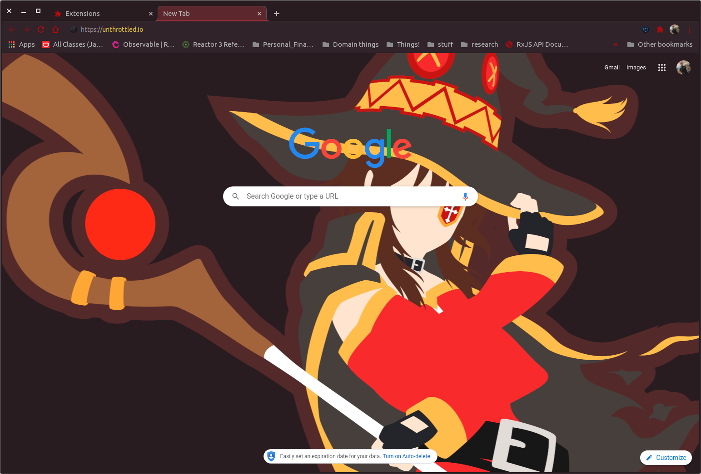
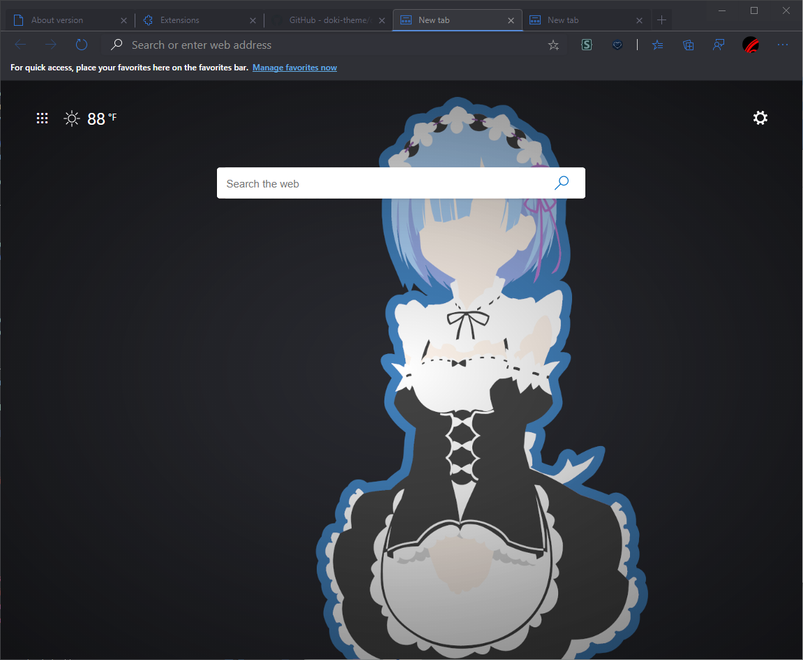
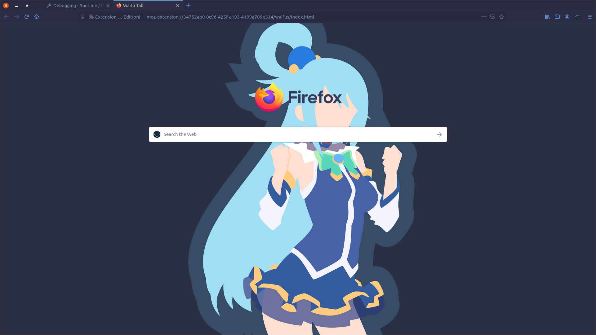
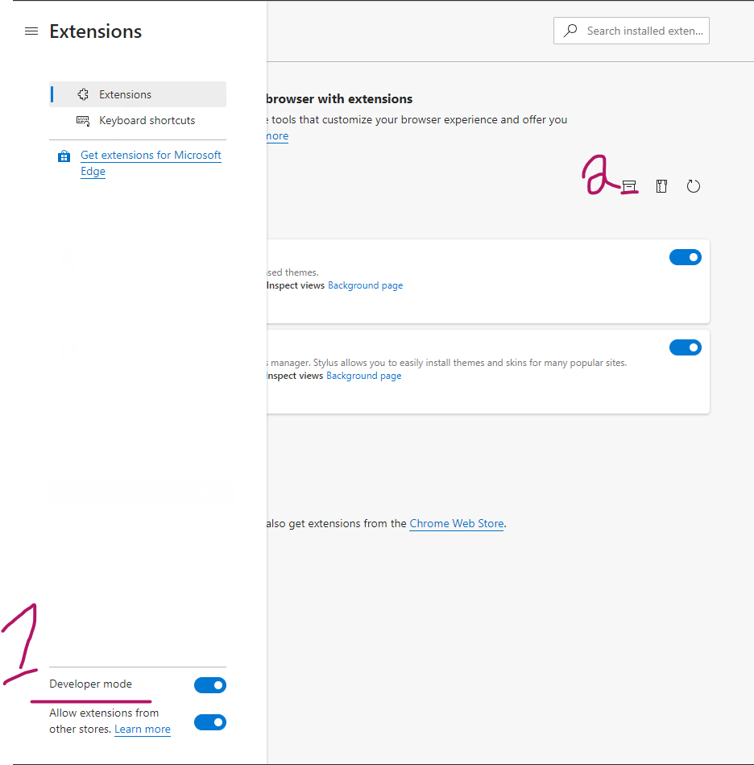
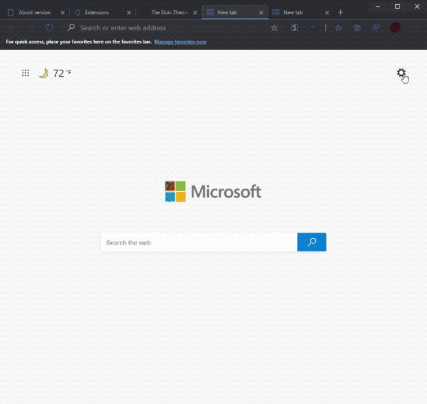
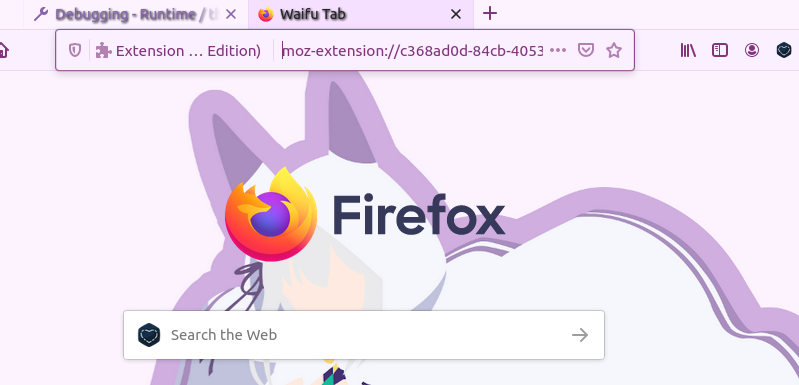
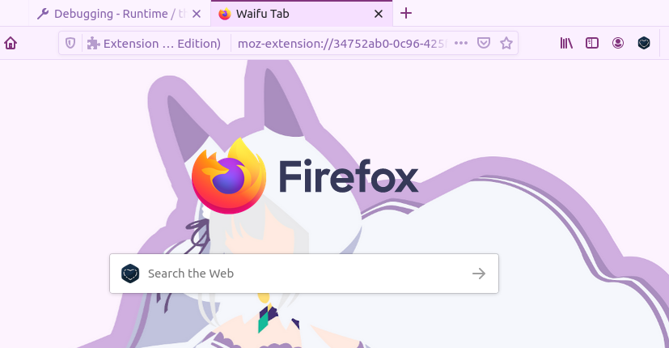

# Feature Preview

## Chrome

## Microsoft Edge

## FireFox

## Features

### Suggestive Content

    </img>

So I thought it was a good idea to add a bit of culture to this plugin.
Ya boi is horny on main.

I will give you a bit of a warning before you install suggestive content.
Some of us are professional Otaku, who want to remain, well...professional.
Don't worry if you choose to continue, I won't ask you again for that specific theme.

Applies for the following content:

- Rias Onyx: Secondary Content

Due to limitations of the platform(s), the Doki Theme has been broken into 2 pieces.

### Theme

Chromium based browsers only allows modifications to the look and feel of the browser when the extension is a theme.
You can find installable versions of these extensions in the `chromeThemes`|`edgeThemes` directory of the repository.

### Master Extension

If you would like even more Doki-Theme in your web-browsing experience then this plugin is for you.
This will modify the CSS of every webpage that you visit with CSS that is themed to your current waifu.

Things that are currently changed:

- Selection foreground/background
- Scrollbars 

# Installation

> This process demonstrates local installation. 
> You should be able to install these themes from the Chrome store soon!

Steps: 
1. Install Emilia Dark's theme.
1. Use the Master Extension popup to change how CSS is altered github.
1. See that scroll bar and selection colors are now themed.
1. Install Rem's theme.
1. Use the Master Extension options to change how CSS is altered.
1. Demonstrate that old css alteration is still present.
1. Refresh
1. Observe that updated css alterations are now present.

## Chrome

Ideally, these plugins should be distributed by the **Chrome web store**.
Until then, you'll have to do a local install.

1. Clone this repository
1. Open Chrome
1. Open the Extension Management page by navigating to chrome://extensions.
    - The Extension Management page can also be opened by clicking on the Chrome menu, hovering over More Tools then selecting Extensions.
1. Enable Developer Mode by clicking the toggle switch next to Developer mode.
1. Click the LOAD UNPACKED button and select the extension directory.
    
1. Navigate to the cloned repository
    1. To install a theme, go to `chromeThemes` and just select the theme directory you want and `open` or confirm.
    1. To install the master extension, go to `masterExtension` and just select the `installable_extension` directory and `open` or confirm.
1. Enjoy!

## Microsoft Edge

### Prerequisites

- Edge v83.0.471.0 or above [consider downloading the canary/dev version](https://www.microsoftedgeinsider.com/en-us/download)

### Steps

1. Clone this repository
1. Open Edge
1. Open the Extension Management page by navigating to edge://extensions.
    - The Extension Management page can also be opened by clicking on the Edge menu, hovering over More Tools then selecting Extensions.
1. Enable Developer Mode by clicking the toggle switch next to Developer mode (1).
1. Click the LOAD UNPACKED button and select the extension directory (2).

1. Navigate to the cloned repository
    1. To install a theme, go to `edgeThemes` and just select the theme directory you want and `open` or confirm.
    1. To install the master extension, go to `masterExtension` and just select the `installable_extension` directory and `open` or confirm.
1. Navigate to a new empty tab in the browser.
1. Select the settings in the upper right-hand corner.
1. Choose `Custom` layout.
1. Choose `Your own image` and upload your chosen background.
    - You can find background images in the `chromeThemes` directory [here is Rem's 1920x1080.](https://github.com/doki-theme/doki-theme-web/blob/master/chromeThemes/Rem's%20Theme/images/rem.png)

1. Enjoy!

## Mozilla Firefox

### Prerequisites

- Mozilla Firefox 63 or above

### Steps
1. Clone this repository
1. Open Firefox
1. Type in the search bar `about:debugging`
1. Select *This Firefox* and click *Load Temporary Add-on...*
1. Choose the *manifest.json* file in the Firefox directory
1. Now, select the doki-theme icon on the toolbar & Choose a theme to load
1. And that's it!

### Issues

**Light theme tab text**

- [How to fix](https://github.com/doki-theme/doki-theme-web/wiki/Firefox-light-themes) issue

| before | after |
| --- | --- |
|  | |

## About the plugin!

These Chrome extensions are for serious Otaku web surfers.
With over **20** chrome themes, based off of various waifus,
I think you will find your best girl.

Variety is the spice of life! 
So you can choose themes from various, Anime, Manga, or Visual Novels:

- Doki-Doki Literature Club
- Re:Zero
- Kill La Kill
- KonoSuba
- DanganRonpa
- High School DxD
- Lucky Star
- Sword Art Online

# Got Contributions, fun ideas, or issues?

The Chrome platform is has a fairly limited feature set.
However, I'll do my best to accommodate, so submit [an issue](https://github.com/doki-theme/doki-theme-web/issues/new).

## Dev Setup

Please see the [contributing](./CONTRIBUTING.md) file for development concepts and setup.

## Enjoying the plugin and want more people to use it?

Great! I am glad you like it!

Be sure to share it with others who also may enjoy it as well!

## Not your thing or something bothering you?

Feel free to submit your feedback as [an issue](https://github.com/doki-theme/doki-theme-web/issues/new).
Help make these extensions better!

---

    </img>

