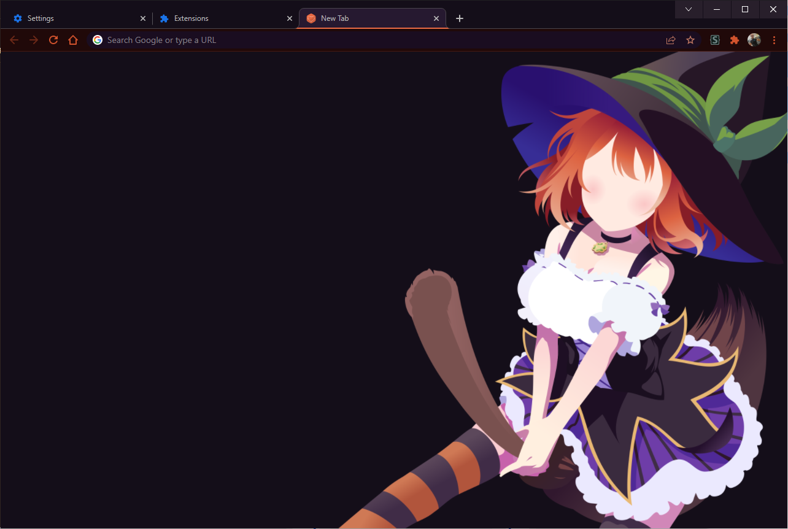
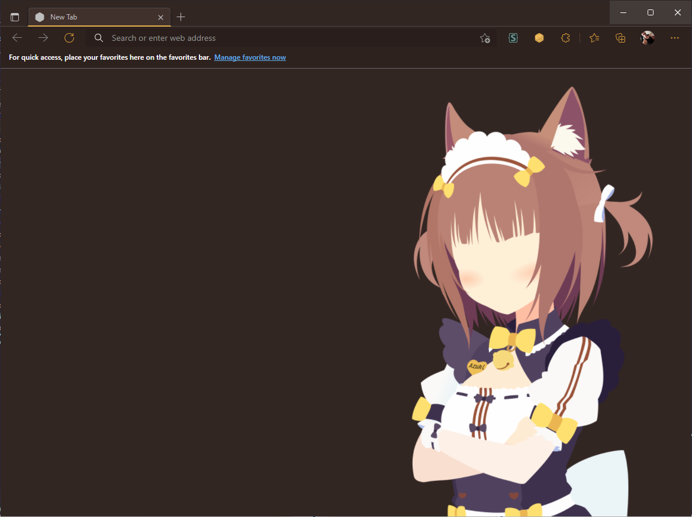

# Doki Theme Web
| Google Chrome                                                   | Microsoft Edge                                          | 
|-----------------------------------------------------------------|---------------------------------------------------------|
|  |  |

# Table of Contents

**Note**: Doki Theme for Firefox [has been moved to another repository](https://github.com/doki-theme/doki-theme-firefox).

- [Feature Set](#feature-set)
- [Installation](#installation)
  - [Google Chrome](#google-chrome)
  - [Microsoft Edge](#microsoft-edge)
- [Contributions and Issues](#contributions-and-issues)

    
# Feature Set

Because Chrome & Edge are jerks, I need to provide 2 extensions: 
  - One to theme your browser
  - One to modify the contents of your active tab & Theme your New tab.

**Theme Extension**

This makes your browser look and feel like it is part of the Doki Theme.

**New Tab Extension**

This extension overrides your New Tab, and replaces it with a tab whose background has the official Doki Theme asset.
It also can inject styles into ever tab to theme the: Scroll Bar & Selection text, to match your selected theme.

### Configuration

You can configure the extension by opening the popup menu & clicking:
- The Doki Theme logo located at the top.

# Installation

## Google Chrome

https://user-images.githubusercontent.com/15972415/157995434-30b5bdfc-b005-416f-a3fa-4bfdf72bc1be.mp4

### Steps
1. Clone this repository
1. Open Chrome
1. Open the Extension Management page by navigating to chrome://extensions.
    - The Extension Management page can also be opened by clicking on the Chrome menu, hovering over More Tools then selecting Extensions.
1. Enable Developer Mode by clicking the toggle switch next to Developer mode.
1. Click the LOAD UNPACKED button and select the extension directory.
1. Navigate to the cloned repository
    1. To install a theme, go to `chromeThemes` and just select the theme directory you want.
    1. Then choose the `newTab` directory and `open` or confirm. Repeat this process for the `theme` extension.
1. Enjoy!

## Microsoft Edge

https://user-images.githubusercontent.com/15972415/157995436-98b957e0-1274-4f65-934d-27b857792ec7.mp4

### Steps
1. Clone this repository
2. Open Edge
3. Open the Extension Management page by navigating to edge://extensions.
    - The Extension Management page can also be opened by clicking on the Edge menu, hovering over More Tools then selecting Extensions.
4. Enable Developer Mode by clicking the toggle switch next to Developer mode (1).
5. Click the LOAD UNPACKED button and select the extension directory (2).
6. Navigate to the cloned repository
  1. To install a theme, go to `edgeThemes` and just select the theme directory you want.
  1. Then choose the `newTab` directory and `open` or confirm. Repeat this process for the `theme` extension.
7. Enjoy!

# Contributions and Issues

Got Contributions, fun ideas, or issues? Keep in mind, the Chromium platform has a fairly 
limited feature set, however, I'll do my best to accommodate. [Submit an issue](https://github.com/doki-theme/doki-theme-web/issues/new).  

Not your thing or something bothering you? Feel free to submit [your feedback](https://github.com/doki-theme/doki-theme-web/issues/new).

**Help make these extensions better!**

## Dev Setup
Please see the [contributing](./CONTRIBUTING.md) file for development concepts and setup.

## Enjoying the plugin?
Great! I am glad you like it!

Be sure to share it with others who also may enjoy it as well!

---

    </img>

