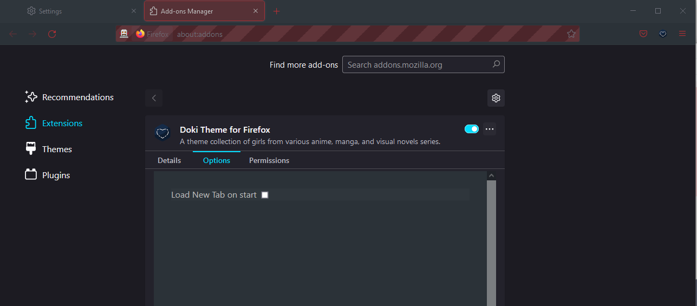

# Feature Preview

## Google Chrome

## Microsoft Edge

## FireFox

# Browser Docs

- [Chrome](#chrome)
- [Edge](#microsoft-edge)
- [FireFox](#mozilla-firefox)

## Features

### Suggestive Content

    </img>

So I thought it was a good idea to add a bit of culture to this plugin.
Ya boi is horny on main.

I will give you a bit of a warning before you install suggestive content.
Some of us are professional Otaku, who want to remain, well...professional.
Don't worry if you choose to continue, I won't ask you again for that specific theme.

Applies for the following content:

- Rias Onyx: Secondary Content

Due to limitations of the platform(s), the Doki Theme has been broken into 2 pieces.

### Theme

Chromium based browsers only allows modifications to the look and feel of the browser when the extension is a theme.
You can find installable versions of these extensions in the `chromeThemes`|`edgeThemes` directory of the repository.

### Master Extension

If you would like even more Doki-Theme in your web-browsing experience then this plugin is for you.
This will modify the CSS of every webpage that you visit with CSS that is themed to your current waifu.

Things that are currently changed:

- Selection foreground/background
- Scrollbars 

# Installation

> This process demonstrates local installation. 
> You should be able to install these themes from the Chrome store soon!

Steps: 
1. Install Emilia Dark's theme.
1. Use the Master Extension popup to change how CSS is altered github.
1. See that scroll bar and selection colors are now themed.
1. Install Rem's theme.
1. Use the Master Extension options to change how CSS is altered.
1. Demonstrate that old css alteration is still present.
1. Refresh
1. Observe that updated css alterations are now present.

## Chrome

Ideally, these plugins should be distributed by the **Chrome web store**.
Until then, you'll have to do a local install.

1. Clone this repository
1. Open Chrome
1. Open the Extension Management page by navigating to chrome://extensions.
    - The Extension Management page can also be opened by clicking on the Chrome menu, hovering over More Tools then selecting Extensions.
1. Enable Developer Mode by clicking the toggle switch next to Developer mode.
1. Click the LOAD UNPACKED button and select the extension directory.
    
1. Navigate to the cloned repository
    1. To install a theme, go to `chromeThemes` and just select the theme directory you want and `open` or confirm.
    1. To install the master extension, go to `masterExtension` and just select the `installable_extension` directory and `open` or confirm.
1. Enjoy!

## Edge

### Prerequisites

- Edge v83.0.471.0 or above [consider downloading the canary/dev version](https://www.microsoftedgeinsider.com/en-us/download)

### Steps

1. Clone this repository
1. Open Edge
1. Open the Extension Management page by navigating to edge://extensions.
    - The Extension Management page can also be opened by clicking on the Edge menu, hovering over More Tools then selecting Extensions.
1. Enable Developer Mode by clicking the toggle switch next to Developer mode (1).
1. Click the LOAD UNPACKED button and select the extension directory (2).

1. Navigate to the cloned repository
    1. To install a theme, go to `edgeThemes` and just select the theme directory you want and `open` or confirm.
    1. To install the master extension, go to `masterExtension` and just select the `installable_extension` directory and `open` or confirm.
1. Navigate to a new empty tab in the browser.
1. Select the settings in the upper right-hand corner.
1. Choose `Custom` layout.
1. Choose `Your own image` and upload your chosen background.
    - You can find background images in the `chromeThemes` directory [here is Rem's 1920x1080.](https://github.com/doki-theme/doki-theme-web/blob/master/chromeThemes/Rem's%20Theme/images/rem.png)

1. Enjoy!

## Mozilla Firefox

- [Features](#firefox-features)
  - [General](#firefox-general-settings)
  - [Theme Settings](#firefox-theme-settings)

### 1.) Mozilla's Add-on Store Install

You can find the extension on the [FireFox addon marketplace.](https://addons.mozilla.org/en-US/firefox/addon/doki-theme-for-firefox/)

### 2.) Manual Install

If you don't feel like downloading the addon from the store, then follow the below steps.

#### Prerequisites

- Mozilla Firefox 95 or above

#### Steps
1. Clone this repository
2. Open Firefox
3. Type in the search bar `about:debugging`
4. Select *This Firefox* and click *Load Temporary Add-on...*
5. Choose the *manifest.json* file in the Firefox directory
6. Now, select the doki-theme icon on the toolbar & Choose a theme to load
7. And that's it!

***Warning:*** This is a temporary way of installing *Doki Theme*. Everytime the browser is closed, the extension 
must be reinstalled again using these steps.

### Configuration

You can configure the extension by:

1. Right-click the extension in the toolbar.
2. Manage Extension
3. Under Doki Theme for Firefox choose `Options`

**OR**
1. Open the extension in the toolbar
2. Click on the *Doki Theme* logo

**Load New Tab on start** is not enabled by default. 
When enabled, when the browser will first open, it will open a tab with your Waifu in the background.
There is a know issue with session restoration on re-open though. [See GitHub issue for more details](https://github.com/doki-theme/doki-theme-web/issues/51).

### FireFox Features

#### Firefox General Settings

**Load Doki Theme page on startup** allows the plugin to automatically load the browser with the empty tab, which show's your current theme's character!
_Note:_ This will break the restore previous open tab settings on startup feature.

**Text Selection** requires the add-on to be able to modify your current tab to override the default text selection colors to match the current Doki Theme.

**Scrollbar** themes the current tab's scrollbars to match the Doki Theme standard scrollbar color.

#### FireFox Theme Settings

The Doki Theme for FireFox can synchronize with your device theme settings.

Never want to see light mode ever again? No problem! The *Options page* now allows you to choose
between `light`, `dark`, `device`, `druthers`, or `all` *(all themes)*. So take your time and
browse.

**Match Device**

`device` will load only themes based on your current device theme settings *(either light or dark)*.
In other words, your device settings determines what characters are present in the popup menu.

#### Random Select *(Dark System Setting)*
https://user-images.githubusercontent.com/23222943/146148772-c7e236ed-6be6-46b6-ac2d-aa3f1b1326ca.mp4

#### Mixed Mode *(Light System Setting)*
https://user-images.githubusercontent.com/23222943/146149663-22ad428e-0cc7-45f8-9700-1fc4c6f616d2.mp4

**Druthers**

`druthers` is similar to `device` except the character chosen for the light theme and the
character chosen for the dark theme will alternate depending on your current device settings.

For clarity, if I choose *Maple* for the **light theme** & *Jahy-sama* for the **dark theme**.
If the device setting is **currently dark**, then the **dark** *Jahy-sama's* theme will show. If the device
setting is *light*, then the **light** *Maple* theme will show.

**Example**

https://user-images.githubusercontent.com/23222943/146766085-ecb1b416-a678-4cbc-a75c-44c7fb5b32de.mp4

**Dark Only**

`dark` will load only dark themes. The popup menu will only load dark themes. This is for all you
dark theme lovers out there!

**Light Only**

`light` will load only light themes. The popup menu will only load light themes. This is for all
you light theme lovers out there!

**All**

`all` is the default settings of Doki Theme. All themes will be present.

### Issues

**Light theme tab text**

- [How to fix](https://github.com/doki-theme/doki-theme-web/wiki/Firefox-light-themes) issue

| before | after |
| --- | --- |
|  | |

# Got Contributions, fun ideas, or issues?

The Chrome platform is has a fairly limited feature set.
However, I'll do my best to accommodate, so submit [an issue](https://github.com/doki-theme/doki-theme-web/issues/new).

## Dev Setup

Please see the [contributing](./CONTRIBUTING.md) file for development concepts and setup.

## Enjoying the plugin and want more people to use it?

Great! I am glad you like it!

Be sure to share it with others who also may enjoy it as well!

## Not your thing or something bothering you?

Feel free to submit your feedback as [an issue](https://github.com/doki-theme/doki-theme-web/issues/new).
Help make these extensions better!

---

    </img>

